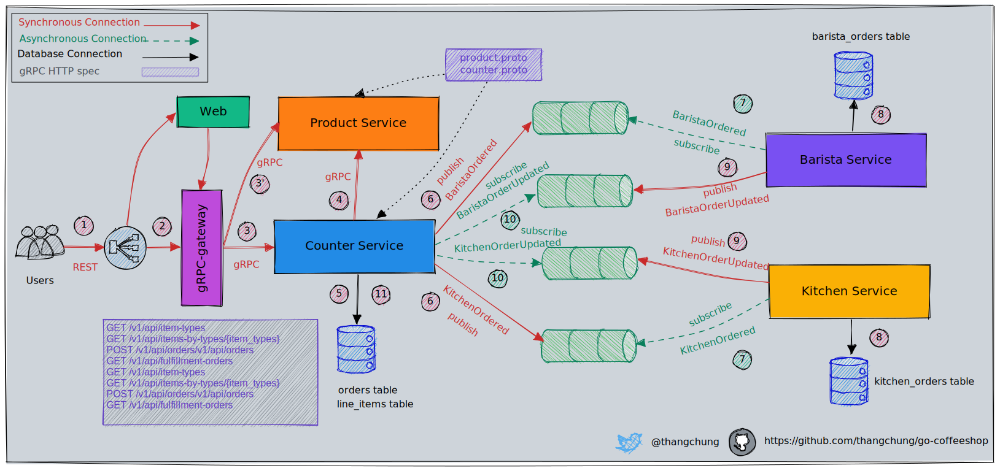
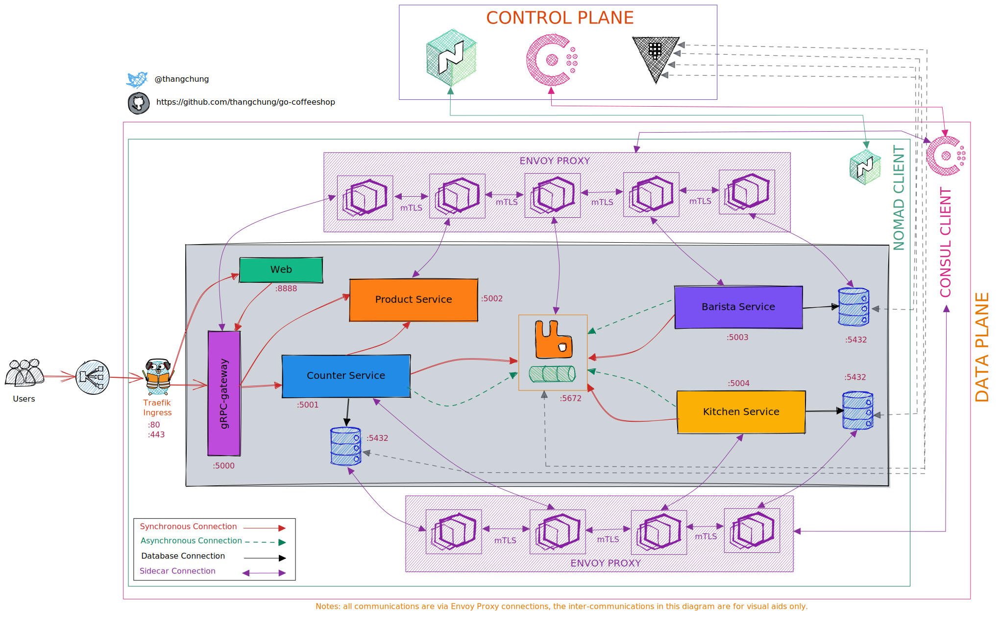

# go-coffeeshop

A coffee shop application with event-driven microservices has been written in Golang. Nomad, Consul Connect, Vault, and Terraform for deployment

Other version can be found at:

- [.NET CoffeeShop with Microservices approach](https://github.com/thangchung/coffeeshop-on-nomad)
- [.NET CoffeeShop with Modular Monolith approach](https://github.com/thangchung/coffeeshop-modular)

## Technical stack
- Backend building blocks
  - [grpc-ecosystem/grpc-gateway/v2](https://github.com/grpc-ecosystem/grpc-gateway)
  - [labstack/echo/v4](https://github.com/labstack/echo)
  - [rabbitmq/amqp091-go](https://github.com/rabbitmq/amqp091-go)
  - [jackc/pgx/v4](https://github.com/jackc/pgx)
  - [Masterminds/squirrel](https://github.com/Masterminds/squirrel)
  - [georgysavva/scany](https://github.com/georgysavva/scany)
  - [golang-migrate/migrate/v4](https://github.com/golang-migrate/migrate)
  - Utils
    - [ilyakaznacheev/cleanenv](https://github.com/ilyakaznacheev/cleanenv)
    - [sirupsen/logrus](https://github.com/sirupsen/logrus)
    - [samber/lo](https://github.com/samber/lo)
    - golang/glog
    - google/uuid
    - google.golang.org/genproto
    - google.golang.org/grpc
    - google.golang.org/protobuf
- Infrastructure
  - Postgres, RabbitMQ
  - Hashicorp Nomad, Consul (Connect), Vault, Terraform
  - docker and docker-compose
  - devcontainer for reproducible development environment

## CoffeeShop - Choreography Saga



## Services

No. | Service | URI
--- | --- | ---
1 | grpc-gateway | [http://localhost:5000](http://localhost:5000)
2 | product service | [http://localhost:5001](http://localhost:5001)
3 | counter service | [http://localhost:5002](http://localhost:5002)
4 | barista service | [http://localhost:5003](http://localhost:5003)
5 | kitchen service | [http://localhost:5004](http://localhost:5004)
6 | web | [http://localhost:8080](http://localhost:8080)

## Starting project

Jump into `.devcontainer`, then

```bash
> docker-compose -f docker-compose-full.yaml build
> docker-compose -f docker-compose-full.yaml up
```

From `vscode` => Press F1 => Type `Simple Browser View` => Choose it and enter [http://localhost:8080](http://localhost:8080).
Enjoy!!!

## Screenshots

### Home screen


### Payment screen


### Order list screen


## HashiCorp stack deployment



The details of how to run it can be find at [deployment with Nomad, Consult Connect and Vault](build/README.md).

## Debug Apps

[Debug golang app in monorepo](https://github.com/thangchung/go-coffeeshop/wiki/Golang#debug-app-in-monorepo)

## Trouble shooting

[Development project trouble shooting](https://github.com/thangchung/go-coffeeshop/wiki#trouble-shooting)

## Roadmap

- Enhance project structure with DDD patterns
- Add testing
- Add and integrate with observability libs and tools
- Add user identity management (authentication and authorization)
- Add resiliency

## Credits

- [project-layout](https://github.com/golang-standards/project-layout)
- [repository-structure](https://peter.bourgon.org/go-best-practices-2016/#repository-structure)
- [go-build-template](https://github.com/thockin/go-build-template)
- [go-clean-template](https://github.com/evrone/go-clean-template)
- [emsifa/tailwind-pos](https://github.com/emsifa/tailwind-pos)
