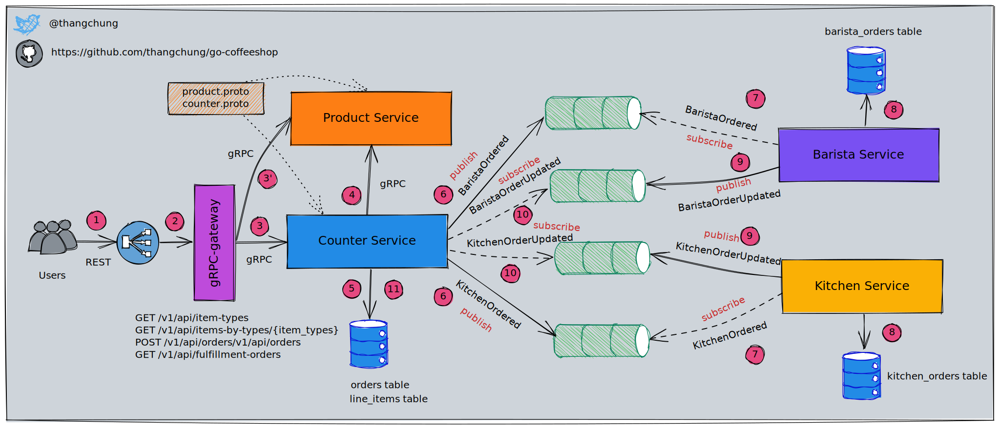
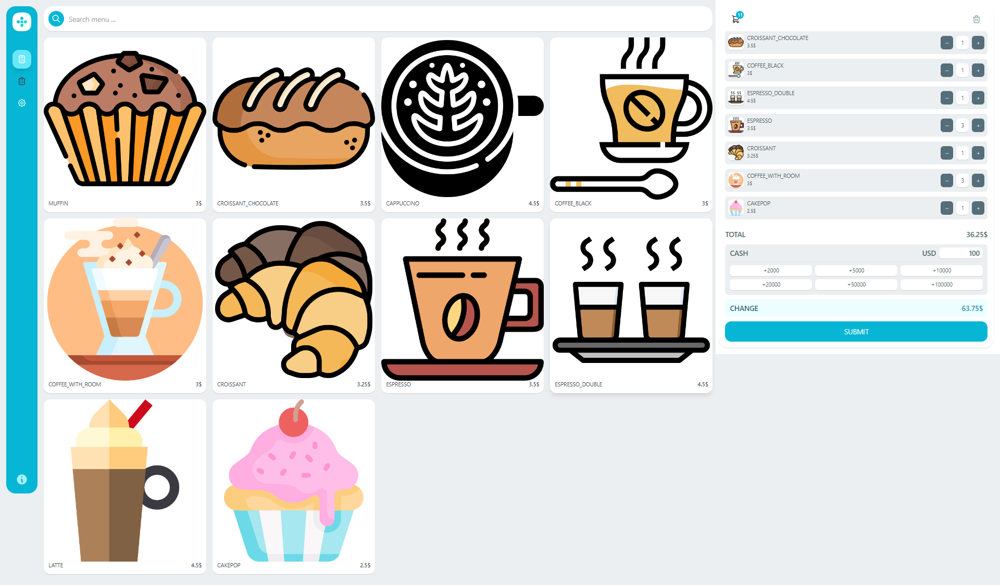
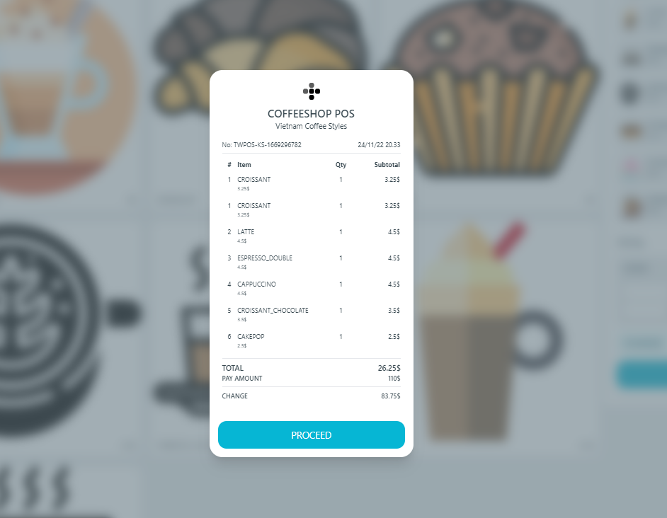
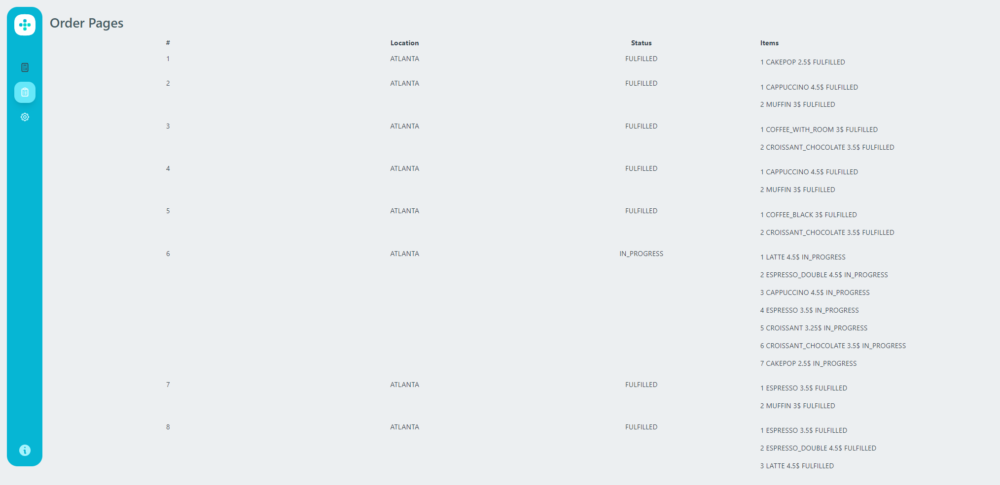

# go-coffeeshop

The coffeeshop with golang

Other version can be found at:

- [.NET CoffeeShop with Microservices approach](https://github.com/thangchung/coffeeshop-on-nomad)
- [.NET CoffeeShop with Modular Monolith approach](https://github.com/thangchung/coffeeshop-modular)

## CoffeeShop - Choreography Saga



## Services

No. | Service | URI
--- | --- | ---
1 | grpc-gateway | [http://localhost:5000](http://localhost:5000)
2 | product service | [http://localhost:5001](http://localhost:5001)
3 | counter service | [http://localhost:5002](http://localhost:5002)
4 | barista service | [http://localhost:5003](http://localhost:5003)
5 | kitchen service | [http://localhost:5004](http://localhost:5004)
6 | web | [http://localhost:8080](http://localhost:8080)

## Starting project

Jump into `.devcontainer`, then

```bash
> docker-compose -f docker-compose-full.yaml build
> docker-compose -f docker-compose-full.yaml up
```

From `vscode` => Press F1 => Type `Simple Browser View` => Choose it and enter [http://localhost:8080](http://localhost:8080).
Enjoy!!!

## Screenshots

### Home screen



### Payment screen



### Order list screen



## Debug Apps

[Debug golang app in monorepo](https://github.com/thangchung/go-coffeeshop/wiki/Golang#debug-app-in-monorepo)

## Trouble shooting

[Development project trouble shooting](https://github.com/thangchung/go-coffeeshop/wiki#trouble-shooting)

## Credits

- [emsifa/tailwind-pos](https://github.com/emsifa/tailwind-pos)
